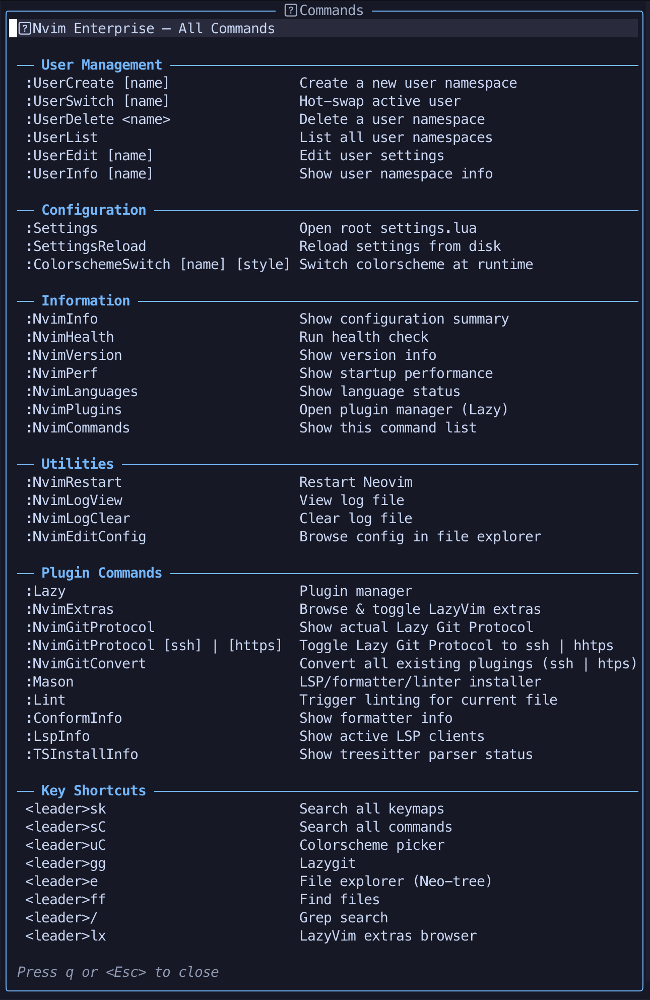

<div align="center">

#  Nvim Enterprise

**Enterprise-Grade · Multi-User · Cross-Platform · Ultra-Modular · High-Performance**

A meticulously engineered, production-ready Neovim framework
designed for professional developers and team environments.

<br/>

[](https://neovim.io/)
[](https://www.lua.org/)
[](./LICENSE)
[](#-cross-platform-support)
[](https://github.com/ca971/nvim-enterprise/actions)

[](#-plugin-ecosystem)
[](#-language-support)
[](#-performance-benchmarks)
[](https://github.com/ca971/nvim-enterprise)

<br/>

<picture>
  <source media="(prefers-color-scheme: dark)" srcset="assets/ca971nvim.png">
  <source media="(prefers-color-scheme: light)" srcset="assets/ca971nvim.png">
  
</picture>

<br/><br/>

[Features](#-key-features) •
[Install](#-installation) •
[Commands](#%EF%B8%8F-enterprise-command-reference) •
[Languages](#-language-support) •
[AI](#-ai-integration) •
[Wiki](https://github.com/ca971/nvim-enterprise/wiki)

</div>

---

## 📑 Table of Contents

<details>
<summary><strong>Click to expand</strong></summary>

- [💎 The Enterprise Edge](#-the-enterprise-edge)
- [✨ Core Philosophy](#-core-philosophy)
- [🚀 Key Features](#-key-features)
- [🌐 Cross-Platform Support](#-cross-platform-support)
- [📦 Requirements](#-requirements)
- [🔧 Installation](#-installation)
- [⚙️ Post-Installation Setup](#%EF%B8%8F-post-installation-setup)
- [⌨️ Enterprise Command Reference](#%EF%B8%8F-enterprise-command-reference)
- [🎛️ Configuration & Settings Engine](#%EF%B8%8F-configuration--settings-engine)
- [📁 Project Structure](#-project-structure)
- [🌍 Language Support](#-language-support)
- [🤖 AI Integration](#-ai-integration)
- [🗺️ Keymap Reference](#%EF%B8%8F-keymap-reference)
- [🛡️ Security & Sandboxing](#%EF%B8%8F-security--sandboxing)
- [⚡ Performance Benchmarks](#-performance-benchmarks)
- [🤝 Contributing](#-contributing)
- [📄 License](#-license)

</details>

---

## 💎 The Enterprise Edge

> **NvimEnterprise** isn't just another dotfile collection — it's a **structured ecosystem** built on
> corporate-grade engineering principles: modularity, security, scalability, and reproducibility.

Whether you're a solo developer optimizing your workflow, a team lead standardizing editor
configurations across engineers, or a sysadmin managing shared server environments —
**NvimEnterprise scales with your needs**.

```
┌──────────────────────────────────────────────────────────────────┐
│                     NvimEnterprise Stack                         │
├──────────────────────────────────────────────────────────────────┤
│                                                                  │
│  ┌──────────┐   ┌──────────┐  ┌──────────┐  ┌─────────────────┐  │
│  │  Users   │   │  Langs   │  │ Plugins  │  │       AI        │  │
│  │Namespace │   │ Modules  │  │ Registry │  │   Providers     │  │
│  │ default  │   │  45+     │  │  35+     │  │ Copilot·Claude  │  │
│  │ jane     │   │ per-file │  │ per-file │  │ Avante·Continue │  │
│  │ john     │   │          │  │          │  │ CodeCompanion   │  │
│  └────┬─────┘   └────┬─────┘  └────┬─────┘  └──────┬──────────┘  │
│       │              │             │               │             │
│  ┌────▼──────────────▼─────────────▼───────────────▼──────────┐  │
│  │        Config Layer (Settings · Plugin · Colorscheme)      │  │
│  │   settings_manager · plugin_manager · colorscheme_mgr      │  │
│  └────────────────────────────┬───────────────────────────────┘  │
│                               │                                  │
│  ┌────────────────────────────▼───────────────────────────────┐  │
│  │         Core Engine (OOP / Class System / Lua 5.4)         │  │
│  │  bootstrap · class · settings · platform · security · log  │  │
│  └────────────────────────────┬───────────────────────────────┘  │
│                               │                                  │
│  ┌────────────────────────────▼───────────────────────────────┐  │
│  │            Neovim 0.10+ Runtime (Nightly OK)               │  │
│  └────────────────────────────────────────────────────────────┘  │
└──────────────────────────────────────────────────────────────────┘
```

---

## ✨ Core Philosophy

| Principle | Description |
| :--- | :--- |
| 🛡️ **Secure** | Path validation, sandbox loading via `core/security.lua`, protected execution |
| 👥 **Multi-User** | Fully isolated namespaces — per-user settings, keymaps, and plugins |
| ⚡ **Blazing Fast** | Aggressive lazy-loading with event/cmd/ft triggers — startup **< 50ms** |
| 🧩 **Modular** | Atomic file structure — one language file, one plugin file, one concern |
| 📈 **Scalable** | From a single laptop to fleet-wide deployment across teams and servers |
| 🌐 **Portable** | Automatic OS/environment detection via `core/platform.lua` |

---

## 🚀 Key Features

<table>
<tr>
<td width="50%" valign="top">

### 🏗️ Architecture & OOP Foundation

- Full **class system** (`core/class.lua`) with inheritance, mixins, and type checking
- **Single `settings.lua`** to control the entire configuration
- **Deep-merge engine** — user overrides cascade cleanly
- **Bootstrap loader** (`core/bootstrap.lua`) — deterministic init sequence
- Protected module loading with structured error handling

</td>
<td width="50%" valign="top">

### 👥 Multi-User Namespace System

- Isolated configs in `lua/users/<name>/` (settings, keymaps, plugins)
- **Hot-swap** users at runtime — `:UserSwitch`
- **CRUD management** via `users/user_manager.lua`
- Namespace isolation (`users/namespace.lua`)
- Ships with `default`, `jane`, and `john` profiles

</td>
</tr>
<tr>
<td width="50%" valign="top">

### 🎨 Visual Design & UI/UX

- **9+ premium colorschemes** — Catppuccin, TokyoNight, Kanagawa…
- Runtime theme switching via `config/colorscheme_manager.lua`
- Powerline statusline (Lualine) with custom components
- Rich dashboard (Snacks.nvim) with quick actions
- Noice.nvim + Dressing.nvim for premium UI overlays

</td>
<td width="50%" valign="top">

### 🔌 Plugin Ecosystem

- **35+ pre-configured plugins** — best-in-class 2025 stack
- Per-plugin toggle from `settings.lua` via `config/plugin_manager.lua`
- Categorized: `ui/` · `editor/` · `code/` · `ai/` · `tools/` · `misc/`
- Optional **LazyVim Extras** integration
- Fully lazy-loaded — event/cmd/ft-based triggers

</td>
</tr>
<tr>
<td width="50%" valign="top">

### 🌍 Language Support

- **45+ languages** with plug-and-play activation
- Treesitter, LSP, linters, formatters, DAP per language
- One file per language in `lua/langs/`
- Template system (`langs/_template.lua`) for new languages

</td>
<td width="50%" valign="top">

### 🤖 AI Integration

- **4 AI plugins**: Copilot · Avante · CodeCompanion · Continue
- Inline chat, code generation, refactoring
- API keys managed securely via environment variables
- **Telemetry-free** — nothing leaves your machine unless you opt in

</td>
</tr>
</table>

---

## 🌐 Cross-Platform Support

> Automatic detection via `core/platform.lua` — optimizations applied transparently.

| Platform | Status | Notes |
| :--- | :---: | :--- |
| 🍎 macOS | ✅ | Native + Homebrew toolchain |
| 🐧 Linux (Ubuntu, Fedora, Arch…) | ✅ | All major distros tested |
| 🪟 Windows | ✅ | PowerShell + scoop/choco |
| 🖥️ WSL / WSL2 | ✅ | Auto-detected, clipboard bridge |
| 😈 FreeBSD / OpenBSD | ✅ | BSD-specific path handling |
| 🐳 Docker / Containers | ✅ | Minimal mode available |
| 🔒 SSH Remote Sessions | ✅ | Reduced UI, clipboard over OSC52 |
| 🖼️ GUI (Neovide, nvim-qt) | ✅ | Font scaling, transparency, animations |

---

## 📦 Requirements

| Dependency | Version | Purpose | Required |
| :--- | :---: | :--- | :---: |
| [Neovim](https://neovim.io/) | `≥ 0.10` | Core editor runtime (Nightly recommended) | ✅ |
| [Git](https://git-scm.com/) | `≥ 2.30` | Plugin management and version control | ✅ |
| [Nerd Font](https://www.nerdfonts.com/) | v3.x | Icon rendering (e.g. JetBrainsMono NF) | ✅ |
| C Compiler | gcc / clang | Treesitter grammar compilation | ✅ |
| [ripgrep](https://github.com/BurntSushi/ripgrep) | `≥ 13.0` | Telescope live grep | ✅ |
| [fd](https://github.com/sharkdp/fd) | `≥ 8.0` | Telescope file finder | ⚠️ |
| [Node.js](https://nodejs.org/) | `≥ 18` | Some LSP servers and Copilot | ⚠️ |
| [Python 3](https://www.python.org/) | `≥ 3.10` | Python LSP and tooling | ⚠️ |

<details>
<summary><strong>📋 Quick install per platform</strong></summary>

**macOS** (Homebrew):
```bash
brew install neovim ripgrep fd git node python3
brew install --cask font-jetbrains-mono-nerd-font
```

**Ubuntu / Debian:**
```bash
sudo apt update && sudo apt install -y ripgrep fd-find git gcc curl
sudo snap install nvim --classic
```

**Arch Linux:**
```bash
sudo pacman -S neovim ripgrep fd git base-devel nodejs python
```

**Fedora:**
```bash
sudo dnf install neovim ripgrep fd-find git gcc nodejs python3
```

**Windows** (Scoop):
```powershell
scoop install neovim ripgrep fd git nodejs python
scoop bucket add nerd-fonts && scoop install JetBrainsMono-NF
```

</details>

---

## 🔧 Installation

### One-Line Install (macOS & Linux)

```bash
curl -fsSL https://raw.githubusercontent.com/ca971/nvim-enterprise/main/install.sh | bash
```

### Windows (PowerShell)

```powershell
git clone https://github.com/ca971/nvim-enterprise.git "$env:LOCALAPPDATA\nvim"
nvim
```

### Manual

```bash
# Backup existing config
for d in nvim; do
  for p in ~/.config/$d ~/.local/share/$d ~/.local/state/$d ~/.cache/$d; do
    [ -e "$p" ] && mv "$p" "${p}.bak"
  done
done

# Clone and launch
git clone https://github.com/ca971/nvim-enterprise.git ~/.config/nvim
nvim
```

> **First launch:** Lazy.nvim will auto-install all plugins. Wait for completion, then run `:NvimHealth`.

---

## ⚙️ Post-Installation Setup

| Step | Action | Description |
| :---: | :--- | :--- |
| 1 | *(automatic)* | Lazy.nvim installs all plugins on first launch |
| 2 | `:NvimHealth` | Verify environment and dependencies |
| 3 | `:TSUpdate` | Install/update Treesitter parsers |
| 4 | `:Mason` | Install LSP servers, linters, formatters |
| 5 | `:NvimInfo` | Review full system overview |
| 6 | `:NvimCommands` | Explore all enterprise commands |

---

## ⌨️ Enterprise Command Reference

> Run `:NvimCommands` to open the interactive **Command Central** floating HUD.

<details open>
<summary><strong>🔍 Configuration & Information</strong></summary>

| Command | Description |
| :--- | :--- |
| `:NvimInfo` | Detailed summary — OS, environment, active user, AI status, runtimes |
| `:NvimVersion` | NvimEnterprise and Neovim version details |
| `:NvimHealth` | Comprehensive health check (`nvimenterprise/health.lua`) |
| `:NvimPerf` | Startup time profiling and per-plugin load statistics |
| `:NvimCommands` | Interactive floating Command Central HUD |
| `:NvimEditConfig` | Quick-jump to configuration root in Neo-tree |

</details>

<details>
<summary><strong>👥 User Management</strong></summary>

| Command | Description |
| :--- | :--- |
| `:UserSwitch` | Hot-swap to a different user namespace without restarting |
| `:UserCreate` | Create a new isolated user namespace with scaffolding |
| `:UserDelete` | Remove an existing user namespace |
| `:UserEdit` | Open the current user's `settings.lua` |
| `:UserList` | List all available user namespaces |

</details>

<details>
<summary><strong>📦 Plugin & Language Management</strong></summary>

| Command | Description |
| :--- | :--- |
| `:NvimPlugins` | Open the Lazy.nvim plugin manager UI |
| `:NvimLanguages` | List available and enabled language modules |
| `:NvimExtras` | Browse and toggle LazyVim extras |
| `:ColorschemeSwitch` | Switch colorscheme at runtime with preview |

</details>

<details>
<summary><strong>🔒 Git & Protocol</strong></summary>

| Command | Description |
| :--- | :--- |
| `:NvimGitProtocol` | View or switch Git protocol (SSH ↔ HTTPS) |
| `:NvimGitConvert` | Bulk-convert plugin remotes to active protocol |

</details>

<details>
<summary><strong>🛠️ Maintenance & System</strong></summary>

| Command | Description |
| :--- | :--- |
| `:NvimRestart` | Hot-restart Neovim — apply changes without losing session |
| `:NvimLogView` | Open the structured log file |
| `:NvimLogClear` | Truncate and clear the framework log |

</details>

---

## 🎛️ Configuration & Settings Engine

NvimEnterprise uses a **single-file settings engine** with deep-merge inheritance:

```
core/settings.lua           ← Framework defaults (lowest priority)
    │
    ▼
settings.lua                ← Global user overrides
    │
    ▼
users/<name>/settings.lua   ← Per-user overrides (highest priority)
```

<details>
<summary><strong>📝 Example: User settings override</strong></summary>

```lua
-- lua/users/jane/settings.lua
return {
  ui = {
    colorscheme = "catppuccin",
    transparent_background = true,
    font = "JetBrainsMono Nerd Font",
    font_size = 14,
  },

  ai = {
    enabled = true,
    provider = "claude",
    model = "claude-sonnet-4-20250514",
  },

  languages = {
    enabled = { "lua", "rust", "go", "typescript", "python", "docker", "json", "yaml" },
  },

  plugins = {
    copilot = false,
    avante = true,
    noice = true,
    flash = true,
    wakatime = false,
  },
}
```

</details>

---

## 📁 Project Structure

> Every file has **one responsibility**. Every directory is a **logical domain**.

```
~/.config/nvim/
├── init.lua                        # Entry point — bootstraps the framework
├── settings.lua                    # Global settings override (user-facing)
├── install.sh                      # One-line installer script
├── lazy-lock.json                  # Plugin version lockfile
│
└── lua/
    ├── config/                     # ── Configuration layer ──────────────
    │   ├── init.lua                #   Config module loader
    │   ├── colorscheme_manager.lua #   Runtime theme switching engine
    │   ├── commands.lua            #   Enterprise command definitions
    │   ├── extras_browser.lua      #   LazyVim extras browser UI
    │   ├── lazy.lua                #   Lazy.nvim bootstrap & plugin loading
    │   ├── lazyvim_shim.lua        #   LazyVim compatibility layer
    │   ├── plugin_manager.lua      #   Per-plugin toggle engine
    │   └── settings_manager.lua    #   Deep-merge settings engine
    │
    ├── core/                       # ── Framework engine (low-level) ─────
    │   ├── init.lua                #   Core module loader
    │   ├── bootstrap.lua           #   Deterministic init sequence
    │   ├── class.lua               #   OOP class system (inheritance, mixins)
    │   ├── settings.lua            #   Default settings & schema
    │   ├── options.lua             #   Neovim option presets
    │   ├── keymaps.lua             #   Global keymap definitions
    │   ├── autocmds.lua            #   Auto-commands
    │   ├── icons.lua               #   Centralized icon/glyph registry
    │   ├── platform.lua            #   OS & environment detection
    │   ├── security.lua            #   Sandbox & path validation
    │   ├── logger.lua              #   Structured logging system
    │   ├── health.lua              #   Core health checks
    │   └── utils.lua               #   Shared utility functions
    │
    ├── langs/                      # ── Language modules (1 file = 1 lang) ─
    │   ├── _template.lua           #   Template for new languages
    │   ├── lua.lua                 #   Lua
    │   ├── python.lua              #   Python
    │   ├── rust.lua                #   Rust
    │   ├── go.lua                  #   Go
    │   ├── typescript.lua          #   TypeScript / TSX
    │   └── ...                     #   45+ language modules
    │
    ├── plugins/                    # ── Plugin specs (categorized) ────────
    │   ├── init.lua                #   Plugin registry loader
    │   ├── ai/                     #   🤖 AI (copilot, avante, codecompanion)
    │   ├── code/                   #   💻 Code (cmp, conform, treesitter, lsp/)
    │   ├── editor/                 #   ✏️  Editor (telescope, neo-tree, flash)
    │   ├── ui/                     #   🎨 UI (lualine, bufferline, noice)
    │   ├── tools/                  #   🔧 Tools (lazygit, toggleterm)
    │   ├── misc/                   #   📦 Misc (startuptime, wakatime)
    │   └── lazyvim_extras/         #   🧩 LazyVim extras integration
    │
    ├── users/                      # ── User namespace system ────────────
    │   ├── init.lua                #   User module loader
    │   ├── namespace.lua           #   Namespace isolation engine
    │   ├── user_manager.lua        #   CRUD operations for profiles
    │   ├── default/                #   Default user profile
    │   ├── jane/                   #   "Jane" example profile
    │   └── john/                   #   "John" example profile
    │
    └── nvimenterprise/             # ── Health check namespace ───────────
        └── health.lua              #   :checkhealth nvimenterprise
```

---

## 🌍 Language Support

Each language is a self-contained module in `lua/langs/` providing Treesitter, LSP, linters,
formatters, and DAP configuration.

| Category | Languages | # |
| :--- | :--- | :---: |
| 🌐 **Web** | TypeScript · JavaScript · Angular · Vue · Svelte · Ember · HTML · CSS · Tailwind · Twig · Prisma | 11 |
| ⚙️ **Systems** | Rust · Go · C/C++ · Zig · CMake | 5 |
| 🐍 **Scripting** | Python · Ruby · PHP · Lua · Elixir · Erlang · Nushell | 7 |
| ☕ **JVM & .NET** | Java · Kotlin · Scala · Clojure · .NET (C#) | 5 |
| 🧮 **Data** | R · Julia · SQL · CSV | 4 |
| 📝 **Config** | JSON · YAML · TOML · XML · Markdown · Nix · Helm | 7 |
| 🏗️ **DevOps** | Docker · Terraform · Ansible · Git | 4 |
| λ **Functional** | Haskell · Elm · Gleam · Lean · OCaml | 5 |

> **Total: 45+ languages** — Add new ones by copying `langs/_template.lua`.

<details>
<summary><strong>Per-language capabilities</strong></summary>

| Capability | Description |
| :--- | :--- |
| 🌳 Treesitter | Syntax highlighting, text objects, folding |
| 🔧 LSP | IntelliSense, go-to-definition, hover, diagnostics |
| 🎨 Formatter | Auto-formatting on save via `conform.nvim` |
| 🔍 Linter | Real-time linting via `nvim-lint` |
| 🐛 DAP | Debug Adapter Protocol support |
| ✂️ Snippets | Language-specific code snippets |
| 🧪 Tests | Test runner integration |

</details>

---

## 🤖 AI Integration

Four independently toggleable AI plugins in `plugins/ai/`:

| Plugin | Features | Provider |
| :--- | :--- | :--- |
| 🟢 **Copilot** | Inline ghost-text suggestions · Chat | GitHub |
| 🟣 **Avante** | AI chat sidebar · Code generation · Refactoring | Multi-provider |
| 🔵 **CodeCompanion** | Chat · Inline assist · Actions | Multi-provider |
| 🟠 **Continue** | IDE-style AI assistant · Local models | Multi-provider |

> 🔒 **Privacy first** — All AI is opt-in. No telemetry. API keys stored in environment variables.

```lua
-- settings.lua
ai = {
  enabled = true,
  provider = "claude",
  model = "claude-sonnet-4-20250514",
}
plugins = {
  copilot = true,
  avante = true,
  codecompanion = false,
}
```

---

## 🗺️ Keymap Reference

> **Leader:** `<Space>` — Press and wait for **Which-Key** to see all bindings.

| Prefix | Category | Examples | Description |
| :---: | :--- | :--- | :--- |
| `<leader>f` | Find | `ff` `fg` `fb` `fh` | Files · Grep · Buffers · Help |
| `<leader>g` | Git | `gg` `gc` `gb` `gd` | Status · Commits · Branches · Diff |
| `<leader>l` | LSP | `la` `ld` `lr` `lf` | Actions · Diagnostics · Rename · Format |
| `<leader>b` | Buffers | `bd` `bn` `bp` `bl` | Delete · Next · Previous · List |
| `<leader>w` | Windows | `wv` `ws` `wq` `w=` | Vsplit · Hsplit · Close · Equalize |
| `<leader>t` | Terminal | `tt` `tf` `th` `tv` | Toggle · Float · Horizontal · Vertical |
| `<leader>e` | Explorer | `e` | Toggle Neo-tree |
| `<leader>u` | User | `us` `uc` `ud` | Switch · Create · Delete |
| `<leader>n` | Nvim | `ni` `nc` `np` `nr` | Info · Commands · Perf · Restart |
| `<leader>x` | Trouble | `xx` `xd` `xw` | Toggle · Document · Workspace |
| `<leader>s` | Search | `ss` `sw` `sr` | Symbols · Word · Resume |

---

## 🛡️ Security & Sandboxing

| Layer | Mechanism |
| :--- | :--- |
| 🔒 Sandbox Loading | Every user module loaded via `pcall()` in protected context |
| 📁 Path Validation | Commands locked to `stdpath()` directories |
| 🚫 No Telemetry | Zero data leaves your machine unless you enable an AI provider |
| 🔑 Key Isolation | Secrets in environment variables, never in config or logs |
| 🛡️ Input Sanitization | Namespace names validated against directory traversal |
| 📝 Audit Logging | All framework events logged via `core/logger.lua` |

---

## ⚡ Performance Benchmarks

| Metric | Target | Typical |
| :--- | :---: | :---: |
| Cold startup | < 80ms | ~45ms |
| Warm startup | < 50ms | ~30ms |
| Plugin count | 35+ | All lazy-loaded |
| Memory usage | < 100MB | ~60MB |
| LSP attach | < 500ms | ~200ms |

> Run `:NvimPerf` to profile your own setup.

---

## 🤝 Contributing

Contributions are welcome! See [CONTRIBUTING.md](CONTRIBUTING.md) for guidelines.

```bash
# Fork → Branch → Commit → Push → PR
git checkout -b feat/amazing-feature
git commit -m 'feat: add amazing feature'
git push origin feat/amazing-feature
```

| Contribution | How |
| :--- | :--- |
| Add a language | Copy `lua/langs/_template.lua` → `lua/langs/your-lang.lua` |
| Add a plugin | Create a file in `lua/plugins/<category>/` |
| Add a user profile | Create `lua/users/<name>/` following existing patterns |

---

## 📄 License

[MIT](./LICENSE) — free to use, modify, and distribute for personal, educational,
or commercial purposes.

---

<div align="center">


**Crafted with ❤️ by [ca971](https://github.com/ca971) - Christian ACHILLE, for dev teams and enterprise.**

[⬆ Back to Top](#-nvimenterprise)

[](https://github.com/ca971/nvim-enterprise/releases/latest)
[](https://github.com/ca971/nvim-enterprise)
[](https://github.com/ca971/nvim-enterprise/issues)
[](https://github.com/ca971/nvim-enterprise/fork)

</div>
